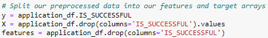
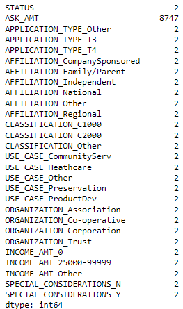
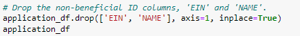
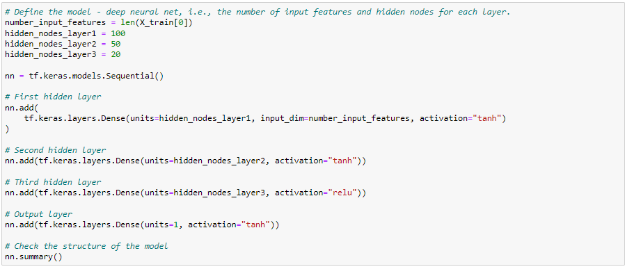
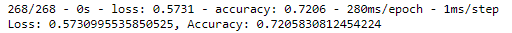

# Charity Grant Analysis Using Neural Networks

## Overview of Analysis
After learning all about Neural Networks, we were tasked with applying our knowledge on a dataset of applications for charitable grants. Specifically, we were asked to come up with a model  that is capable of predicting whether applicants will be successful if funded by Alphabet Soup.

## Results

### Data Preprocessing
The following considerations were made as we preprocessed our data:
	- We identified "IS_SUCCESSFUL" as our target variable
	
	

	- We identified "APPLICATION_TYPE", "AFFILIATION", "CLASSIFICATION", "USE_CASE", "ORGANIZATION", "STATUS", "INCOME_AMT", "SPECIAL_CONSIDERATIONS" and "ASK_AMT" as features
	- We then ecoded variables without intergers so we could pass these variables through our model
	
	

	- We removed 'EIN' and 'NAME' since they were neither features or targets

	

### Compiling, Training, and Evaluating the Model
The following considerations and observations were made as we built and tested our model:
	- We set up our model with the displayed configurations
	
	

	- We did not achieve our target of 75% accuracy

	

	- We took several steps to try to increase our performance without a possitive result:
		- Creating more bins for rare occurrences in columns.
		- Increasing or decreasing the number of values for each bin.
		- Adding more neurons to a hidden layer.	
		- Adding more hidden layers.
		- Using different activation functions for the hidden layers.
		- Increasing number of epochs to the training regimen.

## Summary
We did not achieve our desired results of 75% accuracy even after making more than two dozen adjustments. We have concluded that a different model may be more appropriate for this dataset. We recommend trying a logistic regression or a random forrest in order to achieve a model with higher accuracy.

	
	